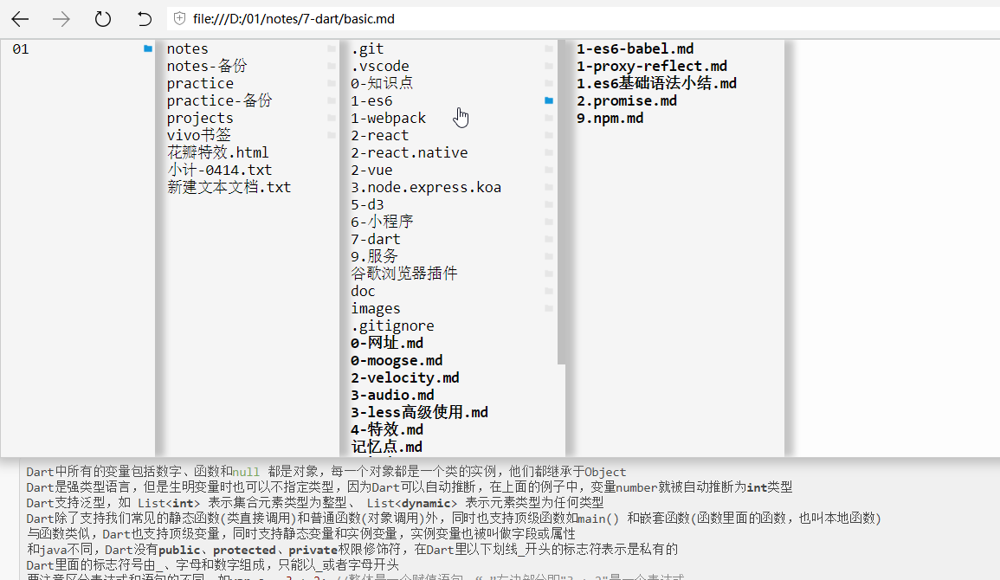

### 功能
    读取并展示markdown文件，高亮代码块
    读取此markdown文件的上层文件目录,可以在当前markdown文件展示页面中快速访问系统中的其他markdown文件

### 安装目录
    chrome://extensions/

### 相关库的使用
    https://github.com/coreyti/showdown/
    http://code.google.com/p/google-code-prettify/

    https://github.com/showdownjs/showdown
    https://github.com/showdownjs/table-extension
    
    vue2
    lodash

### __marked.min.js插件
     _marked.min.js插件的基本配置(存在问题: '1. a \n * b' 展示有误)
     
     简单使用：
     marked.setOptions({
     	renderer: new marked.Renderer(),
     	gfm: true,
     	tables: true,
     	breaks: false,
     	pedantic: false,
     	sanitize: false,
     	smartLists: true,
     	smartypants: false,
     });
     document.getElementById('markdown-container').innerHTML = marked(lastText);

### 效果

